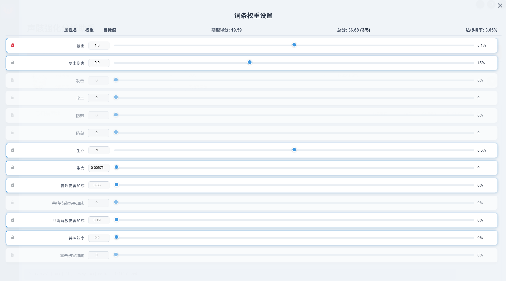
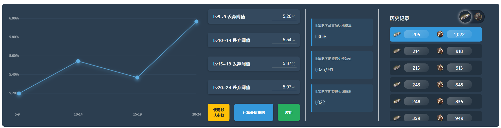
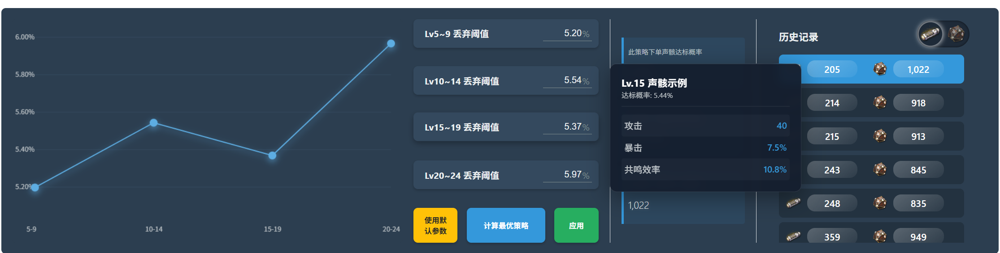
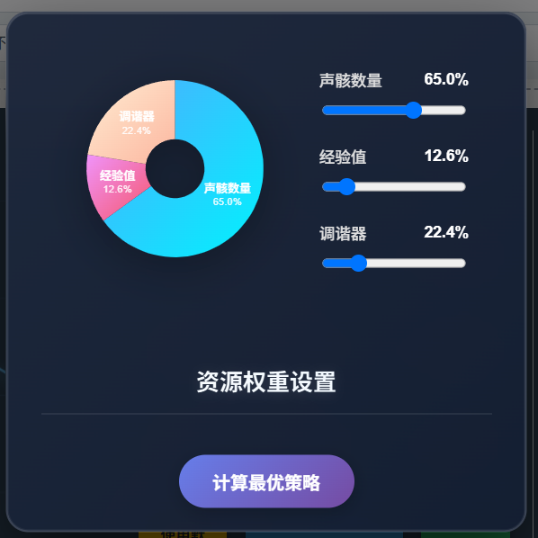
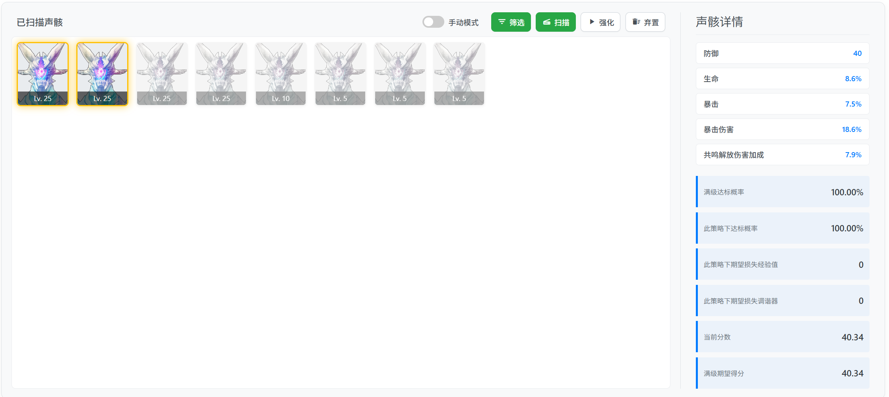
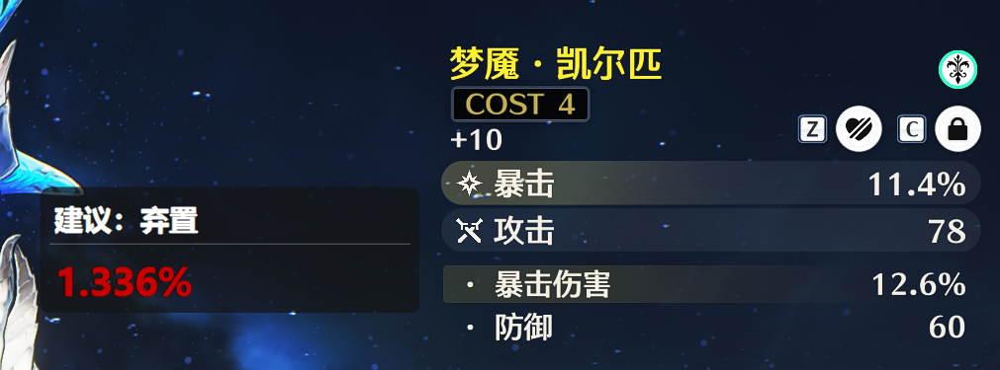

<div align="center">
  
  <h1 align="center">Wuthering Waves Toolbox</h1>
  <h2 align="center"><a herf="https://github.com/PlanarG/ww-toolbox/blob/main/README.md">English</a> | 中文</h2>
</div>

欢迎使用 Wuthering Waves Toolbox，这是一个基于图像识别的工具集，它能够为你的游戏内数据提供严谨、综合的数据分析，以精确的概率武器直指你遇到的各种难题。同时，Wuthering Waves Toolbox 也提供一系列的自动化子程序，即使是小白也能一步到位摇身变成资源分析大师！目前这个项目还处于开发阶段，部分功能可能会存在稳定性问题，欢迎在 issue 中反馈。

## 🎉 功能列表

- 高度自由的词条权重系统，你可以任意设定自己想要的权重，锁定需要的词条。词条考虑大/小值的区别，对应概率来源于[统计视频](https://www.bilibili.com/video/BV16SVzzbEar)。
- 近乎无穷的策略空间，借助精确的资源消耗计算，让不同强化策略的优劣一目了然。
- 强大的最优策略计算工具，可指定胚子数量/经验值/调谐器数量的重要程度，让你的期望消耗逼近理论下界。
- 可进入手动强化模式，通过浮窗实时显示强化建议，让你能赌得有理有据，也死得明明白白。
- 提供懒人专属的自动强化模式，与其和声骸斗智斗勇，不如放置一下午享受游戏外的精彩人生。

## 💻 安装指南

如果你希望能下载安装包或者无需编译就能直接运行的程序，请移步 [releases](https://github.com/PlanarG/ww-toolbox/releases)，国内镜像在 [mirror](https://disk.pku.edu.cn/anyshare/zh-cn/link/AA48862C598BBB4DFD8A6695D9B227E599)。

对于开发者，你可以通过如下方式构建这个项目：

### 🧱 安装依赖

- Python (建议 `3.11` 及以上)
- [Node.js](https://nodejs.org/en)，我们的前端基于 electron。
- [Visual Studio Build Tools](https://visualstudio.microsoft.com/visual-cpp-build-tools/)，需要用其构建 C++ 接口加速计算。

### 🎡 开始构建

首先 clone 本项目到你的本地文件夹

```bash
git clone git@github.com:PlanarG/ww-toolbox.git
cd ww-toolbox
```

构建后端。我们推荐使用 `conda` 管理你的 Python 虚拟环境，避免不同环境的版本冲突。

```bash
# 创建并激活虚拟环境
conda create -n ww-toolbox python=3.11
conda activate ww-toolbox

# 安装 Python 依赖
pip install -r requirements.txt

# 检查依赖安装情况并编译 C++ 接口
pip install -e .
```

接下来安装前端依赖并构建前端。

```bash
# 进入前端文件夹
cd frontend

# 安装依赖
npm install

# 运行前端
npm start .
```

需要注意的是，在开发模式下程序不会请求管理员权限，但它需要管理员权限才能正常截图，否则截出来的图会全黑。

## ⚡ 快速上手

初次打开程序，你的界面应该长得像这样 

<div align="center">
  
</div>

此时程序只会显示这个选择角色以及指定声骸的部分，请先在最左侧指定你想要**强化谁的声骸以及对应的套装**。你选择的角色会被用于初始化后面的权重列表，套装则用于筛选声骸。

<div align="center">
  
</div>

选定这俩之后，右侧的所有按钮都可以交互了，COST / 主属性 / 声骸名能进一步指定你需要强化的声骸，这些值会被用于后续的筛选与识别。之后，请点击右侧的齿轮按钮指定你的**强化目标**以及**微调词条权重**。

<div align="center">
  
</div>

这张图里已经选定了部分目标，里面包含这些信息：

- 各个词条的**权重**，像暴击/暴伤/大生命这样以百分比为单位的词条，其计量单位为 1%，其余词条的计量单位为 1。比如此时暴击所占词条数为 1.8 * 8.1 = 14.58。
- **锁定了暴击词条**，表示你希望最终声骸必须包含暴击词条，对其数值不做要求。
- 当前的目标是 “暴击 8.1%, 暴伤 15%，生命 8.6%”**对应的分数**，即 36.68 分，你希望最终的声骸分数不低于这个目标。
- 此时随机强化一个声骸到 25 级，期望得分为 19.59，达到你指定的 36.68 分，且包含暴击词条的概率为 3.65%。 

你可以根据达标概率判断达成你的这个目标的难易程度。当你选定好强化目标后即可关闭这个页面。

<div align="center">
  
</div>

此时下方会出现策略选择界面。最左侧的折线图和中间部分的四个**丢弃阈值**用于精细调整策略，你可以修改中间的概率，也可以拖动左侧的四个小圆点，滚轮可以缩放折线图的尺度。丢弃阈值的含义与这个程序采用的强化策略密切相关：在 5 级、10 级、15 级以及 20 级时，计算当前声骸满级能够达到设定目标的概率，如果这个概率低于你指定的值，则放弃强化。你作出的修改不会实时反应到右侧的历史记录中，需要点击中间绿色的“应用”按钮精确计算其资源消耗。右上角的切换按钮仅会更改历史记录的排序方式：按照消耗经验值或者调谐器数量从小到大排列。

<div align="center">
  
</div>

当你的鼠标停留在中间的四个强化阈值上时，右侧会弹出一个悬浮窗口，显示达标概率高于设定的阈值、且出现概率最高的词条示例。你可以对自己的声骸究竟能有多烂有一个直观的感受。

<div align="center">
  
</div>

点击计算最优策略按钮会进入资源权重设置页面。由于声骸强化需要的三种资源几乎不可能同时最小化，因此我们设定了权重用于衡量各个资源的重要程度。比如，如果你把调谐器的权重拉满，意思就是可以假设你有无限的胚子数量以及经验，只需要最小化调谐器数量。点击下方那个很漂亮的按钮即可算出最优策略。

<div align="center">
  
</div>

接下来是声骸检视页面，它用于展示所有扫描出的声骸以及对应的统计数据。**金色**边框表示已达标的声骸，**灰色**则表示算法认为应当弃置的声骸，蓝色表示值得一试应该继续强化的声骸。强化声骸时，我们支持两种模式：

1. **手动模式**，顾名思义，就是你自己定夺每个声骸是否强化，将手动模式的开关拨至右侧即可开启此模式，拨回左侧则关闭。在这个模式下，当你打开游戏，进入角色的声骸页面（随便一个部位）时，会弹出一个浮窗，展示算法的强化建议以及此声骸的达标概率。浮窗可以**自由拖动**，用 `f` 键**切换是否显示**，它始终置于所有窗口的最上层。在这个页面下，你可以点按 `g` 键**强化一次当前声骸**。由于此时的强化是点击固定坐标，因此稳定性可能欠佳。如果游戏在 5 秒内没有反应则可认为强化终止，你也可以手动强化当前声骸，但请务必确保按下 `g` 键时位于这个页面。

2. **自动模式**，关闭手动模式的模式就是自动模式。此时右侧的**筛选**、**扫描**、**强化**、**弃置**四个按钮将可以点击。**筛选**用于应用第一个步骤选定的声骸筛选方案，**扫描**用于检测所有的非 0 级声骸并评估，**强化**用于启动全自动的强化策略：自动选择应强化的声骸、自动升级、自动调谐，总之全部都是自动，直至强化出目标声骸或者经验不足/调谐器不足/胚子不足/程序出错。它将严格遵循之前选定的强化策略。**弃置**用于丢弃所有不可能达标（灰色）的声骸。如果任务成功完成，按钮将变为绿色，反之变为红色，强化的过程可以通过再次点击随时中断。在某个按钮的流程正在运行时，请不要点击其它按钮。一个合理的流程是依次从左往右点击这四个按钮：先筛选胚子，接着扫描已经升级过的胚子，开始强化，最终回收垃圾。

<div align="center">
  
</div>

如果你非常有耐心地看到了这里，那么你已经精通了整个强化流程，是时候开始揉捏你的声骸了！

## 📖 文档

敬请期待。

## 📜 开源协议

Wuthering Waves Toolbox 使用 MIT 协议开源。 请参考 [`LICENSE`](./LICENSE)。